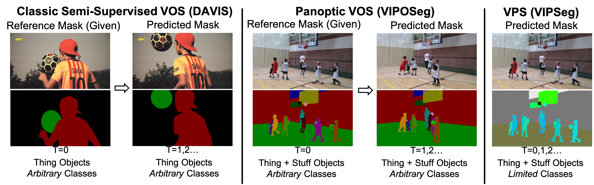
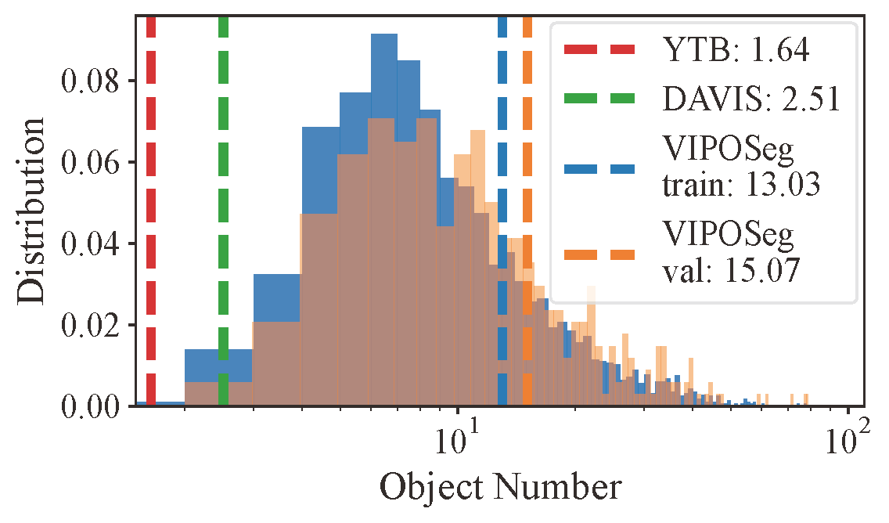
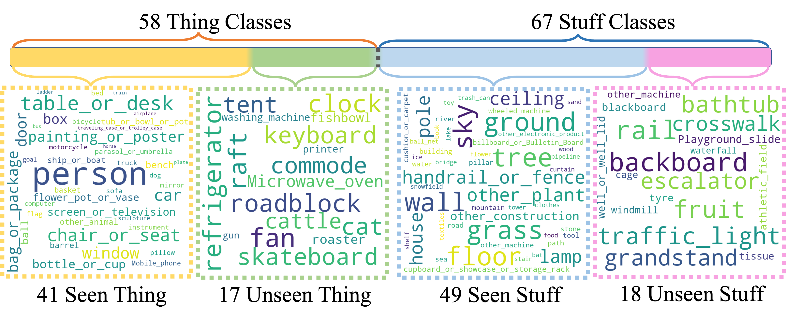

# VIPOSeg-Benchmark

## Introduction
In the paper ["Video Object Segmentation in Panoptic Wild Scenes"](https://arxiv.org/abs/2305.04470), we introduce semi-supervised video object segmentation (VOS) to panoptic wild scenes and present a large-scale benchmark VIPOSeg as well as a baseline method Panoptic AOT.
- Training and validation sets are released in this repository.
- Code for the baseline method Panoptic AOT (PAOT) is released in the paot branch of [aot-benchmark](https://github.com/yoxu515/aot-benchmark).

### VOS in Panoptic Scenes


Our new benchmark (VIPOSeg) contains exhaustive object annotations and covers various real-world object categories which are carefully divided into subsets of thing/stuff and seen/unseen classes for comprehensive evaluation. Note that VIPOSeg is adapted from [VIPSeg](https://github.com/VIPSeg-Dataset/VIPSeg-Dataset), a dataset for video panoptic segmentation in the wild.

### Dataset Preview


### Dataset Statistics


Considering the challenges in panoptic VOS, we propose a strong baseline method named panoptic object association with transformers (PAOT), which uses panoptic identification to associate objects with a pyramid architecture on multiple scales. The code is released in the paot branch of [aot-benchmark](https://github.com/yoxu515/aot-benchmark).

## VIPOSeg Dataset

### Download
train [[Google Drive]](https://drive.google.com/file/d/1GdhTyV8s6wJi8HnlncBWoI2gb_CmrbS1/view?usp=sharing)

valid [[Google Drive]](https://drive.google.com/file/d/1E6cB6FqXhLKT6N5_NEXO7QckwH45IWU2/view?usp=sharing)

### File Organization
```
VIPOSeg
|
└───train
|   |   JPEGImages
|   |   Annotations
|   └───obj_class.json
|
└───valid
    |   JPEGImages
    |   Annotations
    |   Annotations_gt
    |   obj_class.json
    └───meta.json
```
In training set, video sequences are stored in folders under JPEGImages and their annotations are stored under Annotations. The annotations includes masks for all frames in training videos.

In valid set, "Annotations" only includes the first-frame mask for each object. "Annotations_gt" include ground truth masks for all frames, which is used for metric calculation. There may be multiple frames because new objects can appear in the middle of a video. The meta.json provides information about all frames in which each object appears.

### Class Mapping
VIPOSeg keeps the class index from [VIPSeg](https://github.com/VIPSeg-Dataset/VIPSeg-Dataset). The obj_class.json record the mapping from object index to class index.
For example, the first object in a sequence has the object index "1", and it belongs to class "7". From the class index, we can know whether this object is thing or stuff. This information is needed in panoptic AOT.


## Evaluation on VIPOSeg
Follow the commands in vop_eval.sh for evaluation on VIPOSeg. It requires the the paths of prediction results and groud truth annotations ("valid/Annotations_gt").

The evaluation metrics include mask IoU and boundry IoU for each class subsets, and the decay constant.

## Citations
```
@article{xu2023video,
  title={Video Object Segmentation in Panoptic Wild Scenes},
  author={Xu, Yuanyou and Yang, Zongxin and Yang, Yi},
  journal={arXiv preprint arXiv:2305.04470},
  year={2023}
}
@inproceedings{miao2022large,
  title={Large-scale Video Panoptic Segmentation in the Wild: A Benchmark},
  author={Miao, Jiaxu and Wang, Xiaohan and  Wu, Yu and Li, Wei and Zhang, Xu and Wei, Yunchao and Yang, Yi},
  booktitle={Proceedings of the {IEEE} Conference on Computer Vision and Pattern Recognition},
  year={2022}
}
@inproceedings{miao2021vspw,
  title={Vspw: A large-scale dataset for video scene parsing in the wild},
  author={Miao, Jiaxu and Wei, Yunchao and Wu, Yu and Liang, Chen and Li, Guangrui and Yang, Yi},
  booktitle={Proceedings of the IEEE/CVF Conference on Computer Vision and Pattern Recognition},
  pages={4133--4143},
  year={2021}
}
```

## License
The data is released for non-commercial research purpose only.